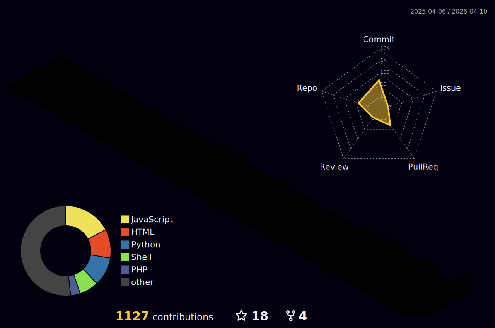

  

  

  <b>Software Engineer</b> · Backend & Web Dev · Automation Enthusiast

  
  

### 🚀 About Me
I build scalable backends, automate workflows, and set up robust CI/CD pipelines.  
Currently integrating **Shopify**, internal APIs, and modern DevOps on **Linux + Docker**.

---

### 🧠 Core Expertise
- 🧩 Backend Architecture & API Design  
- 🐧 DevOps & Infra (Docker, Linux, GitHub Actions)  
- ⚙️ Automation (schedulers, integrations, messaging)  
- 🌐 Full-Stack (Laravel + Angular)  

---

### 💻 Tech Stack

  
   
  
   
  

---

### 📊 GitHub Insights

  
  

<!-- Activity Graph -->

  

---
### 🌍 Beyond Code
- 🥊 Boxing · 🏀 Basketball  
- 🔧 Tinkering with new tech  
- 📚 Lifelong learning  

<!-- Opcionales: Snake y 3D contrib (se generan con Actions). Mantenlos al final para no recargar. -->

### 🐍 Contributions Snake (auto-update)

  

### 🧊 3D Contribution

  

